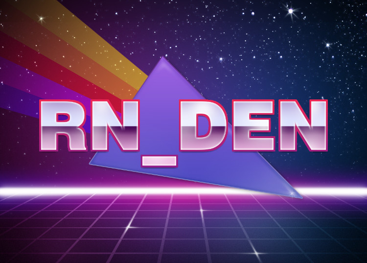

# RN_DEN

This is a Pytorch implementation of dense correspondence network (dense object descriptor) for robot manipulation and keyframe based navigation.

The code is based on the ResNet34 feature extraction encoder and the RetinaNet conv2D/upsamplig decoder. 

The cost function and training method are based on the following paper : 

- Tanner Schmidt, Richard Newcombe, and Dieter Fox, Self-supervised Visual Descriptor Learning for Dense Correspondence. IEEE Robotics and Automation Letters (RA-L) paper presented at the2017 IEEE International Conference on Robotics and Automation (ICRA)Singapore, May 29 - June 3, 2017.
- Lucas Manuelli, Wei Gao, Peter Florence, Russ Tedrake, kPAM: KeyPoint Affordances for Category-Level Robotic Manipulation. arXiv:1903.06684.
- Peter R. Florence, Lucas Manuelli, Russ Tedrake, Dense Object Nets: Learning Dense VisualObject Descriptors By and For Robotic Manipulation. arXiv:1806.08756.
